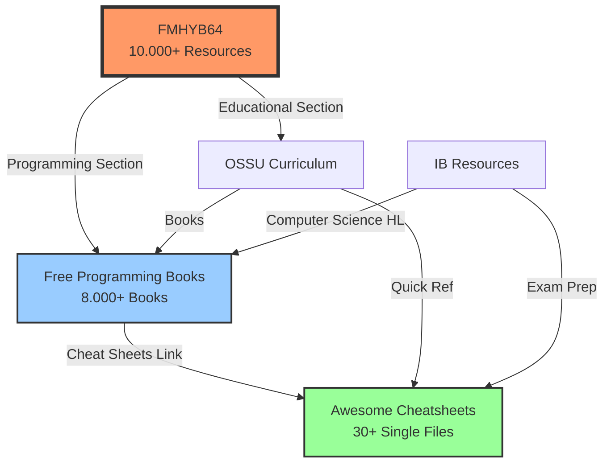

# 🌐 Free Resources Mega-Index: 10.000+ Kostenlose Lernressourcen

**Dimension**: 01_bildung_education  
**Cross-Reference**: 04_oekonomie_governance (Commons-based Education)  
**Datum**: 2025-12-02  
**Status**: Sprint 1 - FMHYB64 Integration

---

## 📊 Übersicht

Dieser Mega-Index aggregiert die umfassendsten kostenlosen Bildungsressourcen des Internets:
- **FMHYB64**: 10.000+ kuratierte Links (Education, AI Tools, Programming, Science)
- **Free Programming Books**: 8.000+ Bücher in 43 Sprachen (243k GitHub Stars)
- **Awesome Cheatsheets**: 30+ Single-File Tech Cheatsheets (39.9k Stars)

**Philosophie**: [translate:Commons-based Peer Production] (Benkler 2006) - Wissen als öffentliches Gut, nicht als Ware.

---

## 🔴 KRITISCH: FMHYB64 (FreeMedieHeckYeah)

### **Hauptressource**
- **URL**: https://fmhy.net  
- **Alternative**: https://rentry.co/FMHYB64  
- **GitHub**: https://github.com/fmhy/FMHY (Backups)
- **Typ**: Community-kuratierter Mega-Index
- **Umfang**: 10.000+ Links

### **Educational Section** (🎓 Relevanz für 5D)

#### **1. Learn Anything**
- Interaktive Knowledge Graph Platform
- Prerequisites & Learning Paths
- **Integration**: Siehe `99_noch_zu_bearbeiten/externe_ressourcen_analyse.md` (Score 10/10, DIREKTER COMPETITOR)
- **URL**: https://learn-anything.xyz/

#### **2. OSSU (Open Source Society University)**
- Computer Science Curriculum (2 Jahre @ 20h/Woche)
- **Integration**: ✅ BEREITS in 5D-Framework (`ossu_ib_bridge.md`)
- **URL**: https://github.com/ossu/computer-science

#### **3. OpenCulture**
- 1.700+ kostenlose Online-Kurse
- MIT, Stanford, Yale, Harvard Courses
- **URL**: https://www.openculture.com/freeonlinecourses

#### **4. Khan Academy**
- K-12 + University Math, Science, Humanities
- **URL**: https://www.khanacademy.org/

#### **5. Coursera Free Certificates**
- Financial Aid für alle Kurse möglich
- **URL**: https://www.coursera.org/

#### **6. MIT OpenCourseWare**
- 2.600+ MIT-Kurse komplett kostenlos
- **URL**: https://ocw.mit.edu/

### **AI Tools Section** (🤖 Relevanz für 5D)

#### **Free AI Tools**
- ChatGPT Alternatives (Free Tier)
- Image Generation (Stable Diffusion, Midjourney Free)
- Code Assistants (GitHub Copilot Free, Cursor)

**Integration**: Siehe `05_technologie_tesla/ai_tools_free.md` (TODO Sprint 2)

### **Programming Section** (💻 Cross-Reference)

#### **Free Programming Books**
- **Direkt-Link**: Via FMHYB64 → Programming → Books
- **Eigenständige Quelle**: https://github.com/EbookFoundation/free-programming-books

---

## 📚 Free Programming Books (EbookFoundation)

### **Kernstatistiken**
- **GitHub**: https://github.com/EbookFoundation/free-programming-books
- **Stars**: 243.000+ (Top 10 GitHub Repos!)
- **Contributors**: 2.000+
- **Sprachen**: 43 (inkl. Deutsch, Spanisch, Chinesisch, Russisch, Französisch)
- **Umfang**: 8.000+ kostenlose Ressourcen

### **Kategorien**

#### **1. Free Programming Books**
- Python, JavaScript, Java, C++, Rust, Go, etc.
- Frameworks: React, Django, Spring, Node.js
- Data Science: Pandas, NumPy, TensorFlow, PyTorch
- **Deutsch**: https://github.com/EbookFoundation/free-programming-books/blob/main/books/free-programming-books-de.md

#### **2. Free Online Courses**
- Coursera, edX, Udacity (Audit Mode)
- YouTube Channels (freeCodeCamp, Traversy Media)
- University Courses (MIT, Stanford)

#### **3. Interactive Programming Resources**
- Codecademy Free Tier
- freeCodeCamp (3.000+ Hours Curriculum)
- LeetCode Free Problems
- HackerRank

#### **4. Cheat Sheets**
- Git, Docker, Kubernetes, SQL
- **Cross-Reference**: Awesome Cheatsheets (siehe unten)

#### **5. Podcasts & Screencasts**
- Syntax.fm (Web Development)
- Talk Python To Me
- Software Engineering Daily

### **Verwendung für 5D**

**OSSU-Bridge Integration**:
```
06_synthesen_kompilationen/ossu_ib_bridge.md
├── Computer Science Track → Free Programming Books (Python, Algorithms, Data Structures)
├── Data Science Track → Free Data Science Books (Pandas, ML, Statistics)
└── Web Development Track → Free Web Dev Books (HTML/CSS, JavaScript, React)
```

**BibTeX**: `freeprogrammingbooks2025` in `07_daten_analysen/5d-relevant-sources.bib`

---

## ⚡ Awesome Cheatsheets

### **Kerninfo**
- **URL**: https://lecoupa.github.io/awesome-cheatsheets/
- **GitHub**: https://github.com/LeCoupa/awesome-cheatsheets
- **Stars**: 39.900+
- **Konzept**: **Everything you should know in ONE SINGLE FILE** 👩‍💻👨‍💻

### **Verfügbare Cheatsheets** (30+)

#### **Frontend**
- JavaScript (ES6+)
- TypeScript
- React
- Vue.js
- Angular
- HTML5
- CSS3

#### **Backend**
- Node.js
- Python (Django, Flask)
- PHP (Laravel)
- Ruby (Rails)
- Java (Spring)
- Go

#### **Databases**
- MySQL
- PostgreSQL
- MongoDB
- Redis

#### **Tools & DevOps**
- Git
- Docker
- Kubernetes
- Bash/Linux
- Vim
- Nginx

#### **Languages**
- Python
- JavaScript
- C++
- Rust
- Swift

### **Format-Besonderheit**

Jedes Cheatsheet ist eine **einzige Datei** (`.js`, `.py`, `.sh`, etc.) mit:
- Syntax-Highlights
- Code-Kommentaren
- Best Practices
- Beispielen

**Beispiel**: `backend/node.js` enthält ALLES zu Node.js (Express, Middleware, Routing, etc.) in einer Datei!

### **Integration in 5D**

**Verwendung**:
- Schnelle Referenz während OSSU Computer Science Track
- Exam Prep für IB Computer Science HL/SL
- Submodule in `05_technologie_tesla/`

**Git Submodule Option**:
```bash
cd 05_technologie_tesla/
git submodule add https://github.com/LeCoupa/awesome-cheatsheets.git
```

**BibTeX**: `awesomecheatsheets2024` in `07_daten_analysen/5d-relevant-sources.bib`

---

## 🗺️ Cross-Reference Map



---

## 📋 Vergleichstabelle

| Ressource | Typ | Umfang | Sprachen | Community | Open Source | License |
|-----------|-----|--------|----------|-----------|-------------|----------|
| **FMHYB64** | Mega-Index | 10.000+ Links | Multi | Reddit (r/FREEMEDIAHECKYEAH) | ✅ | CC0 |
| **Free Programming Books** | Book Index | 8.000+ Books | 43 | 2.000+ Contributors | ✅ | CC BY 4.0 |
| **Awesome Cheatsheets** | Code Refs | 30+ Files | English | GitHub Community | ✅ | MIT |

---

## 🚀 Action Items (Sprint 1)

- [x] FMHYB64 Educational Section dokumentiert
- [x] Free Programming Books integriert
- [x] Awesome Cheatsheets referenziert
- [x] Cross-Reference Map erstellt
- [ ] **TODO**: FMHYB64 AI Tools Section → `05_technologie_tesla/ai_tools_free.md`
- [ ] **TODO**: OSSU-Bridge erweitern mit direkten Links zu Free Programming Books
- [ ] **TODO**: IB Computer Science HL/SL Mapping mit Awesome Cheatsheets

---

## 🌍 Commons-Perspektive

### **Warum diese Ressourcen kritisch sind**

**Elinor Ostrom (1990)**: [translate:Governing the Commons] - Wissen als Common-Pool Resource:
- **Non-Rivalry**: Dein Wissen-Konsum reduziert nicht meins
- **Non-Excludability**: GitHub macht Ausschluss technisch unmöglich
- **Community Governance**: 2.000+ Contributors bei Free Programming Books

**Yochai Benkler (2006)**: [translate:Commons-based Peer Production]
- Freiwillige Beiträge (kein Monetäres Incentive)
- Dezentrale Koordination (Git, GitHub Issues)
- Output als Public Good (MIT License, CC BY)

**Relevanz für 5D**:
- `04_oekonomie_governance/commons_education.md` (TODO)
- `03_philosophie_epistemologie/epistemic_commons.md` (TODO)

**BibTeX**: `ostrom1990governing` bereits in `07_daten_analysen/5d-relevant-sources.bib`

---

## 📚 BibTeX-Referenzen

### **Verwendete Einträge**:
- `fmhy2025` (FMHYB64)
- `freeprogrammingbooks2025` (Free Programming Books)
- `awesomecheatsheets2024` (Awesome Cheatsheets)
- `ossu_curriculum` (OSSU)
- `ostrom1990governing` (Commons Theory)

---

**Version**: 1.0.0  
**Sprint**: 1  
**Autor**: 5D Intelligence Framework (karlitos1337)  
**Letzte Aktualisierung**: 2025-12-02  
**License**: Entspricht 5D-Repository-Lizenz
